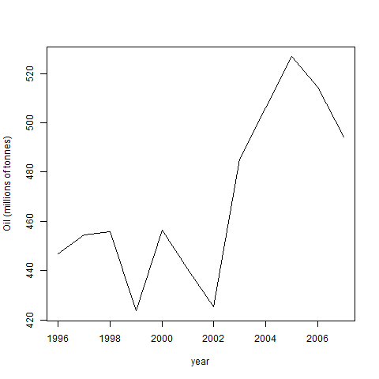
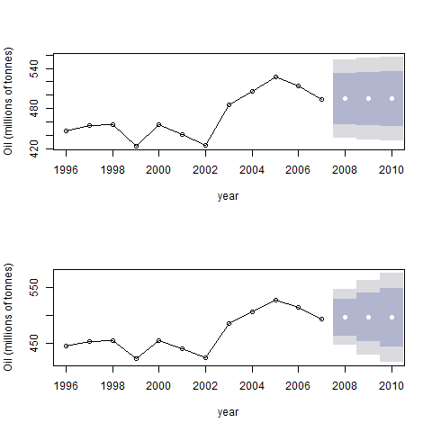
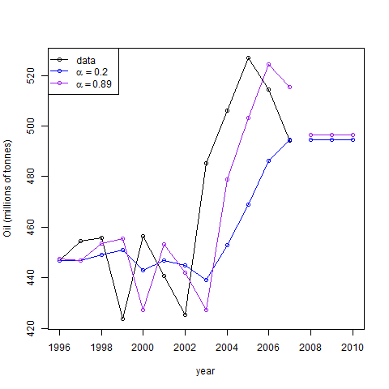

## 滑动平均

Naive的方式对未来的预测，就是取最近一段时间的数据值作为未来的预测值, 这个值就相当于预测点的水平。
用数学的表示方式为：

```
y_prediction for t+1 = average([y_t for t in range(0, T, -1)])
```

## 简单指数平滑(simple exponential smoothing, SES)

SES是一种最简单的预测未来值的方式，它适合用来预测没有趋势以及季节性的数据。它其实就是一种加权的移动平均方式，对每个之前的时间点数据赋予一个指数权重`a * (1 - a)^t for t = 0, 1, ...`，一般来说越近的时间点数据, 权重就更大一些。如果预测t+n，让其t+n都等于t+1的值就好了。


平滑过程：`yhat(t+1) = a * y(t) + (1 - a) * yhat(t)`
误差：`err = yhat(t+1) - y(t+1)`
初始化: 一般取一个值，或者所选序列的均值作为初始预测值
优化目标：`sse = sum(err(t)**2) for t in 1->T`


## 以R代码做演示

```{r}
# 加载所需包
require('forecast')
require('fpp')

# 取一段时间序列
oil_sub = window(oil, start=1996, end=2007)
plot(oil_sub, ylab='Oil (millions of tonnes)', xlab='year')
```



```r
# 利用SES进行平滑预测
fit1 = ses(oil_sub, alpha=.3, initial="simple", h=3)
# 参数有程序自己计算
fit2 = ses(oil_sub, h=3)

# 比较两个模型RMSE
cat("Alpha: ", fit1$model$par['alpha'], " Model rmse: ", sqrt(fit1$model$SSE / length(fit1$x)), "\n")
## >> Alpha:  0.3  Model rmse:  29.65598
cat("Alpha: ", fit2$model$par['alpha'], " Model rmse: ", sqrt(fit2$model$mse), "\n")
## >> Alpha:  0.8920538  Model rmse:  25.12207
```

```r
# 画图查看
par(mfrow=c(2, 1))
plot(fit1, ylab='Oil (millions of tonnes)', xlab='year', main='', fcol='white', type='o')
plot(fit2, ylab='Oil (millions of tonnes)', xlab='year', main='', fcol='white', type='o')
```



```r
# 查看拟合的图像
plot(fit1, ylab='Oil (millions of tonnes)', xlab='year', main='', fcol='white', type='o', PI=F)
lines(fitted(fit1), col="blue", type="o")      # fit1拟合数据
lines(fitted(fit2), col="purple", type="o")    # fit2拟合数据
lines(fit1$mean, col="blue", type="o")         # fit1预测数据
lines(fit2$mean, col="purple", type="o")       # fit2预测数据
legend('topleft', lty=1, col=c(1, 'blue', 'purple'), c('data', expression(alpha==0.2), expression(alpha==0.89)), pch=1)
```

